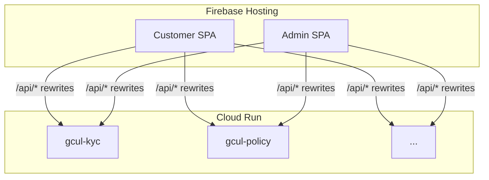

# GCUL cloud deployment

Deploy Java/Python microservices to **Cloud Run** and the customer + admin React apps to **Firebase Hosting**. Both UIs call `/api/*` on the same origin; Hosting rewrites route each prefix to the matching Cloud Run service (same paths as local Vite proxies).

## Prerequisites

- [Google Cloud SDK](https://cloud.google.com/sdk) (`gcloud`) and [Firebase CLI](https://firebase.google.com/docs/cli) (`firebase`)
- Billing enabled on the GCP project
- Node.js 20+ for building `apps/web` and `apps/admin`

Default Firebase/GCP project id in this repo: **`insure360-83a36`** (see `apps/web/firebase.js` and `.firebaserc`).

**Billing:** Cloud Run and Cloud Build require an active billing account on the GCP project. If `insure360-83a36` has no billing, use a billed project that matches Firebase (for example **`community-hub-6fb1b`**) by setting `GCP_PROJECT` before running the scripts. Firebase Hosting rewrites to Cloud Run must use services in the **same** GCP project as Hosting.

## 1. Create or configure the GCP project

```powershell
cd C:\projects\gcul
$env:GCP_PROJECT = "insure360-83a36"   # or your new project id
# Only when creating a brand-new project:
# $env:GCP_BILLING_ACCOUNT = "XXXXXX-YYYYYY-ZZZZZZ"
.\deploy\setup-gcp-project.ps1
```

This enables Run, Cloud Build, Artifact Registry, Firebase, creates the **`gcul-admin`** Hosting site (if missing), and the **`gcul`** Docker repository.

## 2. Deploy microservices to Cloud Run

Builds each service with Cloud Build and deploys ten services:

| Cloud Run service | API prefixes |
|-------------------|--------------|
| `gcul-kyc` | `/api/auth`, `/api/kyc`, `/api/wallet`, `/api/assistant` |
| `gcul-policy` | `/api/products`, `/api/policies`, `/api/quotes`, `/api/payments`, `/api/vendors`, `/api/vendor-portal` |
| `gcul-payment` | `/api/payment-ledger` |
| `gcul-notification` | `/api/notifications` |
| `gcul-claims` | `/api/claims` |
| `gcul-parametric` | `/api/parametric` |
| `gcul-premium-deposit` | `/api/premium-deposits` |
| `gcul-blockchain-orchestrator` | `/api/blockchain` |
| `gcul-sidecar` | (internal; wired into orchestrator) |
| `gcul-chatbot` | `/api/chatbot` |

```powershell
$env:GCP_PROJECT = "insure360-83a36"
.\deploy\deploy-cloud-run.ps1
```

Service URLs are written to `deploy/cloud-run-urls.json`. H2 databases use `/tmp` on Cloud Run (`spring.profiles.active=cloud`); data is ephemeral until you move to Cloud SQL.

Optional env vars (Secret Manager recommended for production):

- **KYC / policy**: `EMAIL_*`, `WEB_BASE_URL` (password-reset links)
- **Policy**: `STRIPE_SECRET_KEY`, `STRIPE_PUBLISHABLE_KEY`
- **Sidecar**: `GCUL_MODE=live`, `GCUL_PROJECT`, `GCUL_ENDPOINT`, …
- **Chatbot**: `OPENAI_API_KEY`, `PINECONE_API_KEY`

## 3. Deploy UIs to Firebase Hosting

```powershell
$env:GCP_PROJECT = "insure360-83a36"
.\deploy\deploy-firebase.ps1
```

- **Customer**: site `insure360-83a36` → `https://insure360-83a36.web.app`
- **Admin**: site `gcul-admin` → `https://gcul-admin.web.app` (or `https://gcul-admin--insure360-83a36.web.app`)

No `VITE_API_BASE` is required in production: APIs are same-origin via Hosting rewrites (`deploy/api-rewrites.json`).

## Files

| Path | Purpose |
|------|---------|
| `deploy/services.json` | Cloud Run service manifest |
| `deploy/docker/Dockerfile.java` | Multi-stage build for Spring Boot services |
| `deploy/deploy-cloud-run.ps1` | Build + deploy all backends |
| `deploy/deploy-firebase.ps1` | Build SPAs + deploy Hosting |
| `.firebaserc` | Firebase project + hosting targets |

## Architecture



Legacy monolith API under `apps/api` is not part of this path; use the Java microservices above.

## Cost + Cloud SQL (one DB per service)

See **[deploy/COST.md](COST.md)**. Summary:

- **Cloud Run**: scale to zero (`minInstances: 0`) — pay mainly when requests run.
- **Cloud SQL**: one cheap **shared** instance, **separate database** per Java service (not one merged schema).
- Enable: `.\deploy\setup-cloud-sql.ps1` then `$env:GCUL_USE_CLOUD_SQL='true'; .\deploy\deploy-cloud-run.ps1`
