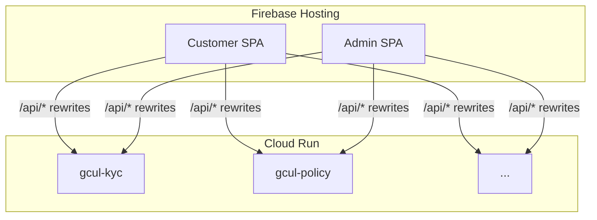

# GCUL cloud deployment

Deploy Java/Python microservices to **Cloud Run** and the customer + admin React apps to **Firebase Hosting**. Both UIs call `/api/*` on the same origin; Hosting rewrites route each prefix to the matching Cloud Run service (same paths as local Vite proxies).

## Prerequisites

- [Google Cloud SDK](https://cloud.google.com/sdk) (`gcloud`) and [Firebase CLI](https://firebase.google.com/docs/cli) (`firebase`)
- Billing enabled on the GCP project
- Node.js 20+ for building `apps/web` and `apps/admin`

Default Firebase/GCP project id in this repo: **`insure360-83a36`** (see `apps/web/firebase.js` and `.firebaserc`).

**Billing:** Cloud Run and Cloud Build require an active billing account on the GCP project. If `insure360-83a36` has no billing, use a billed project that matches Firebase (for example **`community-hub-6fb1b`**) by setting `GCP_PROJECT` before running the scripts. Firebase Hosting rewrites to Cloud Run must use services in the **same** GCP project as Hosting.

## 1. Create or configure the GCP project

```powershell
cd C:\projects\gcul
$env:GCP_PROJECT = "insure360-83a36"   # or your new project id
# Only when creating a brand-new project:
# $env:GCP_BILLING_ACCOUNT = "XXXXXX-YYYYYY-ZZZZZZ"
.\deploy\setup-gcp-project.ps1
```

This enables Run, Cloud Build, Artifact Registry, Firebase, creates the **`gcul-admin`** Hosting site (if missing), and the **`gcul`** Docker repository.

## 2. Deploy microservices to Cloud Run

Builds each service with Cloud Build and deploys ten services:

| Cloud Run service | API prefixes |
|-------------------|--------------|
| `gcul-kyc` | `/api/auth`, `/api/kyc`, `/api/wallet`, `/api/assistant` |
| `gcul-policy` | `/api/products`, `/api/policies`, `/api/quotes`, `/api/payments`, `/api/vendors`, `/api/vendor-portal` |
| `gcul-payment` | `/api/payment-ledger` |
| `gcul-notification` | `/api/notifications` |
| `gcul-claims` | `/api/claims` |
| `gcul-parametric` | `/api/parametric` |
| `gcul-premium-deposit` | `/api/premium-deposits` |
| `gcul-blockchain-orchestrator` | `/api/blockchain` |
| `gcul-sidecar` | (internal; wired into orchestrator) |
| `gcul-chatbot` | `/api/chatbot` |

```powershell
$env:GCP_PROJECT = "insure360-83a36"
.\deploy\deploy-cloud-run.ps1
```

Service URLs are written to `deploy/cloud-run-urls.json`. H2 databases use `/tmp` on Cloud Run (`spring.profiles.active=cloud`); data is ephemeral until you move to Cloud SQL.

Optional env vars (Secret Manager recommended for production):

- **KYC / policy**: `EMAIL_*`, `WEB_BASE_URL` (password-reset links)
- **Policy**: `STRIPE_SECRET_KEY`, `STRIPE_PUBLISHABLE_KEY`
- **Sidecar**: `GCUL_MODE=live`, `GCUL_PROJECT`, `GCUL_ENDPOINT`, …
- **Chatbot**: `OPENAI_API_KEY`, `PINECONE_API_KEY`

## 3. Deploy UIs to Firebase Hosting

```powershell
$env:GCP_PROJECT = "insure360-83a36"
.\deploy\deploy-firebase.ps1
```

- **Customer**: site `insure360-83a36` → `https://insure360-83a36.web.app`
- **Admin**: site `gcul-admin` → `https://gcul-admin.web.app` (or `https://gcul-admin--insure360-83a36.web.app`)

No `VITE_API_BASE` is required in production: APIs are same-origin via Hosting rewrites (`deploy/api-rewrites.json`).

## Files

| Path | Purpose |
|------|---------|
| `deploy/services.json` | Cloud Run service manifest |
| `deploy/docker/Dockerfile.java` | Multi-stage build for Spring Boot services |
| `deploy/deploy-cloud-run.ps1` | Build + deploy all backends |
| `deploy/deploy-firebase.ps1` | Build SPAs + deploy Hosting |
| `deploy/setup-cloud-sql.ps1` | Cloud SQL instance + databases |
| `deploy/setup-pubsub.ps1` | Pub/Sub topics + IAM |
| `deploy/pubsub.json` | Topic catalog (publishers/subscribers) |
| `.firebaserc` | Firebase project + hosting targets |

## Architecture



Legacy monolith API under `apps/api` is not part of this path; use the Java microservices above.

## Cloud SQL: one instance, one database per Java service

This is **not** one Cloud SQL instance per microservice. Cost layout:

| What | Name / pattern |
|------|----------------|
| **Instance** (single shared) | `gcul-pg` in `us-central1` |
| **DB user** | `gcul_app` (password in Secret Manager `gcul-db-password`) |
| **Per-service database** | See `deploy/cloud-sql.json` → `serviceDatabases` |

| Cloud Run service | PostgreSQL database |
|-------------------|---------------------|
| `gcul-kyc` | `gcul_kyc` |
| `gcul-policy` | `gcul_policy` |
| `gcul-payment` | `gcul_payment` |
| `gcul-notification` | `gcul_notification` |
| `gcul-claims` | `gcul_claims` |
| `gcul-parametric` | `gcul_parametric` |
| `gcul-premium-deposit` | `gcul_premium_deposit` |
| `gcul-blockchain-orchestrator` | `gcul_blockchain` |

**No Cloud SQL DB** in this map: `gcul-sidecar`, `gcul-chatbot` (Python; no JPA schema in `cloud-sql.json`).

**Production today:** only **`gcul-kyc`** is confirmed on Cloud SQL. Other Java services may still use **ephemeral H2** in `/tmp` unless you deploy with `GCUL_USE_CLOUD_SQL=true` (and fix DB password via `setup-cloud-sql.ps1`).

```powershell
$env:GCP_PROJECT = "community-hub-6fb1b"
.\deploy\setup-cloud-sql.ps1
$env:GCUL_USE_CLOUD_SQL = "true"
.\deploy\deploy-cloud-run.ps1
```

---

## Pub/Sub (event bus)

Topics are defined in **`deploy/pubsub.json`** (e.g. `gcul.kyc.user-registered`, `gcul.policy.quote-created`). **Infra only** until each service publishes/subscribes in code.

```powershell
$env:GCP_PROJECT = "community-hub-6fb1b"
.\deploy\setup-pubsub.ps1              # topics + IAM for Cloud Run SA
.\deploy\setup-pubsub.ps1 -CreateSubscriptions   # optional pull subs per subscriber
$env:GCUL_USE_PUBSUB = "true"
.\deploy\deploy-cloud-run.ps1         # sets GCUL_PUBSUB_ENABLED, GCUL_PUBSUB_PROJECT, GCUL_PUBSUB_TOPIC_PREFIX
```

---

## Deploy scripts (Cloud Run + Hosting)

| Step | Script | What it does |
|------|--------|----------------|
| 1 | `deploy/setup-gcp-project.ps1` | APIs, Artifact Registry `gcul`, Firebase link, admin hosting site |
| 2 | `deploy/setup-cloud-sql.ps1` | Instance `gcul-pg`, 8 databases, `gcul_app` user, `cloud-sql-connection.json` |
| 3 | `deploy/setup-pubsub.ps1` | Pub/Sub topics from `pubsub.json`, publisher/subscriber IAM |
| 4 | **`deploy/deploy-cloud-run.ps1`** | **Main backend deploy**: Cloud Build per service (`deploy/cloudbuild-service.yaml` + `deploy/docker/Dockerfile.*`), push to `us-central1-docker.pkg.dev/$PROJECT/gcul/<service>:latest`, `gcloud run deploy` from `deploy/services.json` |
| 5 | `deploy/configure-kyc-email.ps1` | Gmail → Secret `gcul-email-pass` on `gcul-kyc` |
| 6 | **`deploy/deploy-firebase.ps1`** | Build `apps/web` + `apps/admin`, generate `firebase.json` from `deploy/api-rewrites.json`, deploy Hosting |
| 7 | `deploy/sync-cloud-api-targets.ps1` | Refresh `deploy/cloud-api.targets.json` for local `VITE_API_PROXY=cloud` |

**`deploy-cloud-run.ps1` env flags:**

- `GCP_PROJECT` (required) — e.g. `community-hub-6fb1b`
- `GCP_REGION` (optional, default `us-central1`)
- `GCUL_USE_CLOUD_SQL=true` — attach Cloud SQL + per-service DB env (see table above)
- `GCUL_USE_PUBSUB=true` — after `setup-pubsub.ps1`
- `-SkipBuild` — redeploy existing images only

**Single service (manual):**

```powershell
cd C:\projects\gcul
$image = "us-central1-docker.pkg.dev/community-hub-6fb1b/gcul/gcul-kyc:latest"
gcloud builds submit . --project=community-hub-6fb1b `
  --config=deploy/cloudbuild-service.yaml `
  --substitutions="_IMAGE=$image,_DOCKERFILE=deploy/docker/Dockerfile.java,_SERVICE_DIR=apps/services/kyc-service"
gcloud run deploy gcul-kyc --image $image --region us-central1 --project community-hub-6fb1b ...
```

Outputs: `deploy/cloud-run-urls.json`, Hosting URLs from `deploy-firebase.ps1`.

---

## Cost + Cloud SQL (one DB per service)

See **[deploy/COST.md](COST.md)**. Summary:

- **Cloud Run**: scale to zero (`minInstances: 0`) — pay mainly when requests run.
- **Cloud SQL**: one cheap **shared** instance, **separate database** per Java service (not one merged schema).
- Enable: `.\deploy\setup-cloud-sql.ps1` then `$env:GCUL_USE_CLOUD_SQL='true'; .\deploy\deploy-cloud-run.ps1`
