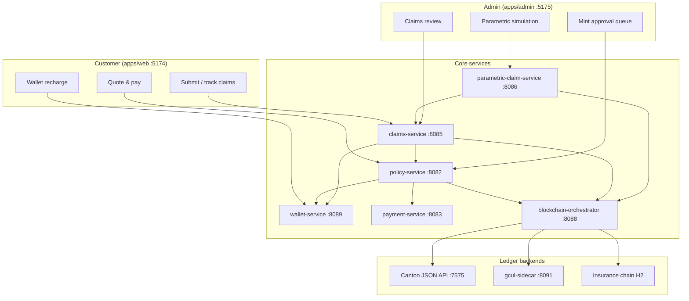
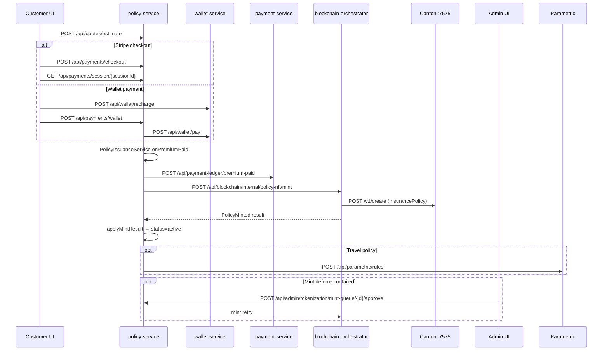
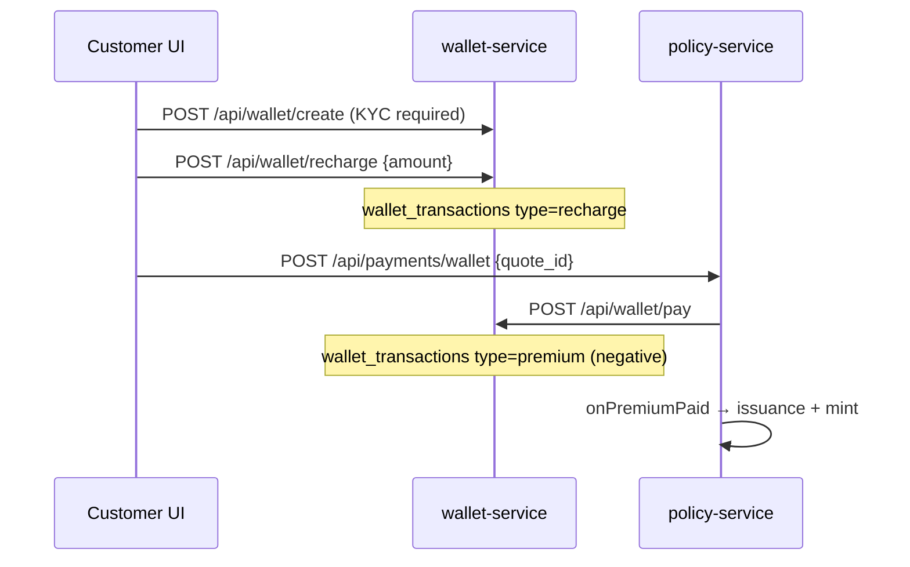
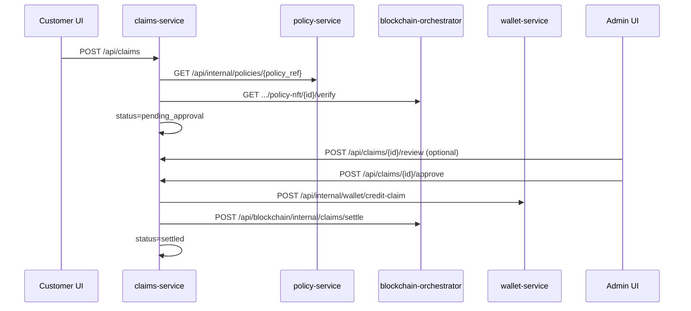

# Minting, Deposits & Claim Processing

End-to-end reference for how policies are minted on Canton, how premium money flows through wallets and ledgers, and how claims are validated, approved, and settled in the current GCUL setup.

**Related docs**

| Topic | Document |
|-------|----------|
| Canton sandbox & Daml templates | [`canton/README.md`](../canton/README.md) |
| Ethereum / insurer mint (optional) | [`docs/BLOCKCHAIN-INSURER-MINT.md`](BLOCKCHAIN-INSURER-MINT.md) |
| Insurance chain (PoA blocks) | [`docs/GCUL-INSURANCE-CHAIN.md`](GCUL-INSURANCE-CHAIN.md) |
| Domain events (Pub/Sub) | [`docs/EVENT-CATALOG.md`](EVENT-CATALOG.md) |
| Local dev ports & commands | [`apps/services/LOCAL-DEV.md`](../apps/services/LOCAL-DEV.md) |

---

## Architecture overview



### Service roles

| Service | Port | Role in these flows |
|---------|------|---------------------|
| `kyc-service` | 8081 | Registration, KYC gate for wallet create/link |
| `policy-service` | 8082 | Quotes, Stripe/wallet premium payment, policy issuance, mint queue |
| `payment-service` | 8083 | Platform payment ledger (audit trail) |
| `claims-service` | 8085 | Claim intake, admin review, payout orchestration |
| `parametric-claim-service` | 8086 | Parametric rules, oracle polling, auto-settlement |
| `premium-deposit-service` | 8087 | Standalone deposit holds (**not** wired into main payment path) |
| `blockchain-orchestrator-service` | 8088 | Policy NFT mint, Canton verify, claim settlement ledger |
| `wallet-service` | 8089 | Customer GBP balance, premium debit, claim credit |
| `gcul-sidecar` | 8091 | GCUL Universal Ledger transfers for claim settlement |
| Canton sandbox | 7575 | Daml contract create/query for policy certificates |

### Event bus

- **Local (default):** `gcul.pubsub.enabled=false` — events dispatch in-process via `LocalEventBus`.
- **Cloud:** Google Pub/Sub topics (`wallet-events`, `payment-events`, `policy-events`, `blockchain-events`).

Key library: `apps/libs/gcul-messaging/`

### Ledger backends (mint + settlement)

Configured in `blockchain-orchestrator-service` via `gcul.ledger.backend` (default **`canton`**):

| Backend | Policy mint | Claim settlement |
|---------|-------------|------------------|
| **Canton** | Daml `Gcul.InsurancePolicy:InsurancePolicy` via JSON API `/v1/create` | GCUL sidecar transfer (`claim_settlement`) |
| **Ethereum** | ERC-721 `mintPolicy` on Sepolia (when enabled) | Same sidecar path |
| **Simulated** | `SIM-{policyId}` token IDs when Canton/Ethereum unavailable | Sidecar fallback → `local_only` ledger row |

---

## Flow 1 — Policy minting

From quote and premium payment through Canton tokenization and optional admin retry.

### Sequence



### Step 1 — Customer prerequisites

1. Register / log in (`kyc-service`)
2. Complete KYC (`POST /api/kyc/submit`)
3. Create or link wallet (`POST /api/wallet/create` or `POST /api/wallet/link`)

### Step 2 — Quote

| Method | Path | Purpose |
|--------|------|---------|
| `POST` | `/api/quotes/estimate` | Returns `quote_id` (e.g. `Q-...`), `estimated_premium`, answers |

### Step 3 — Premium payment

**Option A — Stripe (or demo mode)**

| Method | Path | Purpose |
|--------|------|---------|
| `GET` | `/api/payments/config` | `demo_mode`, `publishable_key` |
| `POST` | `/api/payments/checkout` | `{ quote_id }` → `session_id`, checkout URL |
| `GET` | `/api/payments/session/{sessionId}` | On `payment_status=paid`, triggers issuance |

**Option B — Wallet**

| Method | Path | Purpose |
|--------|------|---------|
| `POST` | `/api/wallet/recharge` | Demo top-up (max £10,000) |
| `POST` | `/api/payments/wallet` | `{ quote_id }` — debits wallet, triggers issuance |

`PremiumPaymentCoordinator.completePremiumPayment` then:

- Calls `PolicyIssuanceService.onPremiumPaid`
- Records ledger: `POST /api/payment-ledger/premium-paid`
- Publishes `PremiumPaid` on `payment-events`

**Key code**

- `apps/services/policy-service/.../StripePaymentService.java`
- `apps/services/policy-service/.../WalletPaymentService.java`
- `apps/services/policy-service/.../PremiumPaymentCoordinator.java`
- `apps/web/src/components/PayQuoteButton.tsx`

### Step 4 — Policy issuance

`PolicyIssuanceService.onPremiumPaid`:

1. Idempotent: skip if policy already exists for `quoteId`
2. Derive `policyId = "POL-" + quoteId.replace("Q-", "")`
3. Resolve customer + wallet address
4. Compute `policyReferenceHash` (`PolicyReferenceHasher`)
5. Resolve **pending** coverage from quote (`PolicyCoverageResolver`) — limits stored, dates activate on mint
6. Create row in `issued_policies`
7. Publish `PolicyCreated`

**Mint gating (automatic attempt)**

| Condition | `mint_status` | Behaviour |
|-----------|---------------|-----------|
| No wallet linked | `PENDING_WALLET` | Policy issued off-chain; mint waits |
| KYC not verified | `PENDING` | Mint deferred |
| Wallet + KYC OK | → mint attempt | HTTP call to blockchain orchestrator |

`WalletLinked` event retries pending mints for that customer.

**Key code:** `apps/services/policy-service/.../PolicyIssuanceService.java`

### Step 5 — Blockchain mint

1. `PolicyIssuanceService.requestBlockchainMint` publishes `PolicyMintRequested`
2. `BlockchainMintClient.mintPolicyNft` → `POST /api/blockchain/internal/policy-nft/mint`
3. **Canton path:** `CantonJsonApiClient` creates `Gcul.InsurancePolicy:InsurancePolicy` → `tokenId` like `CANTON-{suffix}`
4. Save `policy_nft_records`; publish `PolicyMinted`
5. `onPolicyMinted` → `applyMintResult`, `status=active`, `cover_start_at=now`, publish `PolicyActivated`
6. **Travel policies:** `TravelParametricProvisioner` creates flight-delay and trip-cancellation rules

**Key code**

- `apps/services/blockchain-orchestrator-service/.../CantonJsonApiClient.java`
- `apps/services/blockchain-orchestrator-service/.../PolicyNftMintService.java`
- `apps/services/policy-service/.../PolicyRecordService.java` (`applyMintResult`, `ensureMintActivatedCoverage`)

### Step 6 — Admin mint approval (retry)

When auto-mint fails or was deferred, policies appear in the admin mint queue.

| Admin action | Endpoint | Effect |
|--------------|----------|--------|
| View queue | `GET /api/admin/tokenization` | `mint_queue`, `registry`, `stats` |
| Approve mint | `POST /api/admin/tokenization/mint-queue/{policyId}/approve` | Retries mint; **502 if still not MINTED** |
| Reject mint | `POST /api/admin/tokenization/mint-queue/{policyId}/reject` | `mint_status=FAILED`, `status=mint_failed` |

**Admin UI:** `apps/admin/src/pages/TokenizationPage.tsx`

### Mint status transitions

```
(no wallet)      → PENDING_WALLET
(wallet, no KYC) → PENDING
(ready)          → PENDING → (mint attempt) → MINTED
(mint error)     → FAILED
(admin reject)   → FAILED
(admin retry)    → FAILED → PENDING → MINTED
```

On **MINTED**, policy `status` becomes `active` and coverage dates activate (`cover_start_at`, `cover_expires_at`).

### Events published

| Event | Topic | Publisher |
|-------|-------|-----------|
| `PremiumPaid` | `payment-events` | policy-service |
| `PolicyCreated` | `policy-events` | policy-service |
| `PolicyMintRequested` | `policy-events` | policy-service |
| `PolicyMinted` | `blockchain-events` | blockchain-orchestrator |
| `PolicyActivated` | `policy-events` | policy-service |
| `WalletLinked` | `wallet-events` | wallet-service |

---

## Flow 2 — Deposits, wallets & premium payment

> **Important:** The customer-facing “deposit” flow is **wallet recharge + premium debit**. The `premium-deposit-service` is a **separate admin hold/release ledger** and is **not** called by policy-service, wallet-service, or payment-service in the main quote-to-mint pipeline.

### Wallet flow



### Wallet API

| Method | Path | Purpose |
|--------|------|---------|
| `GET` | `/api/wallet` | Balance, address, status |
| `POST` | `/api/wallet/create` | Demo wallet; requires KYC |
| `POST` | `/api/wallet/link` | Link external `0x...` address |
| `POST` | `/api/wallet/recharge` | Credit balance (demo, max £10,000) |
| `POST` | `/api/wallet/pay` | Debit premium (`reference=quote_id`) |
| `GET` | `/api/wallet/transactions` | Recent transactions |

**Internal**

| Method | Path | Purpose |
|--------|------|---------|
| `GET` | `/api/internal/wallet` | Lookup by customerId / email / address |
| `POST` | `/api/internal/wallet/credit-claim` | Claim payout credit |

### Wallet entities

**`customer_wallets`:** `userId`, `userEmail`, `address`, `balanceGbp`, `status`, `provider`, `mode`

**`wallet_transactions`**

| `type` | `amount` | `reference` | When |
|--------|----------|---------------|------|
| `recharge` | positive | `demo-top-up` | Customer tops up |
| `premium` | negative | `quote_id` | Premium payment |
| `claim_payout` | positive | `claim_id` | Claim approved / auto-settled |

Idempotency: duplicate `premium` per `quote_id` or `claim_payout` per `claim_id` returns the existing transaction.

**Key code:** `apps/services/wallet-service/.../WalletService.java`

### Payment ledger (platform audit)

| Method | Path | Purpose |
|--------|------|---------|
| `GET` | `/api/payment-ledger` | List payments |
| `POST` | `/api/payment-ledger/premium-paid` | Upsert paid record (from policy-service) |

**`payment_records`:** `id` (`PAY-...`), `quote_id`, `policy_ref`, `amount`, `status` (`pending` | `paid`), `provider` (`stripe` | `wallet` | `demo`)

**Key code:** `apps/services/payment-service/.../PaymentLedgerService.java`

### Premium deposit service (standalone)

| Method | Path | Status flow |
|--------|------|-------------|
| `POST` | `/api/premium-deposits` | Creates deposit → `held` |
| `POST` | `/api/premium-deposits/{id}/release` | → `released` |
| `GET` | `/api/premium-deposits` | List |

Exposed on the admin **Platform Services** page only — not part of quote → pay → mint.

**Key code:** `apps/services/premium-deposit-service/.../PremiumDepositService.java`

### Customer UI touchpoints

| Screen | File | APIs |
|--------|------|------|
| Wallet setup / recharge | `apps/web/src/pages/WalletPage.tsx` | create, recharge, transactions |
| Pay quote | `apps/web/src/components/PayQuoteButton.tsx` | checkout or `payWithWallet` |
| Payment success | `apps/web/src/pages/PaymentPages.tsx` | `getPaymentSession` |
| Policies | `apps/web/src/pages/NavPages.tsx` | `GET /api/policies/me` |

---

## Flow 3 — Claim processing

Manual claims, parametric auto-settlement, admin review, wallet payout, and blockchain settlement.

### Claim status lifecycle

```
submitted
  → pending_approval        (manual create: auto after validation)
  → in_review               (admin: POST /review)
  → awaiting_customer       (admin sends query to customer)
  → pending_approval        (customer replies — all queries answered)
  → approved
  → payment_pending
  → paid_out                (wallet credited)
  → settled                 (blockchain settlement recorded)

rejected                    (terminal)
```

Constants: `apps/services/claims-service/.../ClaimStatus.java`  
Terminal statuses: `settled`, `rejected`, legacy `paid`

### Manual claim flow



### Customer submit — `POST /api/claims`

```json
{
  "policy_ref": "POL-...",
  "customer_name": "...",
  "customer_id": "...",
  "customer_email": "...",
  "category": "Travel",
  "amount_claimed": 250.0,
  "description": "..."
}
```

**Validation chain** (`ClaimWorkflowService.create`):

1. Fetch policy — `GET /api/internal/policies/{policyRef}`
2. `assertEligibleForClaim` — policy must be minted / active
3. `ClaimCoverageValidator.assertClaimAllowed` — cover dates, category match, aggregate limit
4. Canton verify — `GET /api/blockchain/internal/policy-nft/{policyId}/verify`
5. Fallback: if verify fails but local `tokenId` exists, treat as verified
6. Create `insurance_claims` row; events: `ClaimSubmitted`, `ClaimValidated`, `ClaimPendingApproval`

### Admin actions

| Action | Endpoint | Notes |
|--------|----------|-------|
| Start review | `POST /api/claims/{id}/review` | → `in_review` |
| Send query (RFI) | `POST /api/claims/{claimId}/queries` | → `awaiting_customer` |
| Customer reply | `POST /api/claims/{claimId}/queries/{queryId}/reply` | → `pending_approval` when all answered |
| Upload document | `POST /api/claims/{claimId}/documents` | Multipart; optional `query_id` |
| Approve & pay | `POST /api/claims/{id}/approve` | `{ approved_amount? }` |
| Reject | `POST /api/claims/{id}/reject` | `{ reason }` |

**Approval pipeline** (`approveAndSettle`):

1. Block if open admin queries exist
2. Re-validate coverage; cap amount to remaining policy limit
3. `approved` → `payment_pending`
4. Wallet credit (`claim_payout` transaction) → `paid_out`
5. Blockchain settlement (best-effort) → `settled`
6. If blockchain fails, claim still settles with a deferred note on `validation_notes`

Parametric claims skip category matching but still enforce cover dates and limits.

**Key code**

- `apps/services/claims-service/.../ClaimWorkflowService.java`
- `apps/services/claims-service/.../ClaimCoverageValidator.java`
- `apps/services/claims-service/.../ClaimQueryService.java`
- `apps/admin/src/pages/ClaimsPage.tsx`, `ClaimReviewModal.tsx`
- `apps/web/src/pages/NavPages.tsx`

### Parametric auto-settlement

**Rule provisioning** (on travel policy mint via `TravelParametricProvisioner`):

| Rule type | Metric | Threshold | Default payout |
|-----------|--------|-----------|----------------|
| `flight_delay` | `flight_delay_minutes` | 240 min | £250 (within £1,000 pool) |
| `trip_cancellation` | `trip_cancelled` | 1 (binary) | £150 (within £1,000 pool) |

**Trigger paths**

| Trigger | Endpoint | Source |
|---------|----------|--------|
| Admin simulate delay | `POST /api/parametric/simulate/flight-delay` | `trigger_source=simulation` |
| Admin simulate cancellation | `POST /api/parametric/simulate/trip-cancellation` | |
| Oracle poll (all rules) | `POST /api/parametric/oracle/poll` | Scheduled + manual |
| Oracle poll (one rule) | `POST /api/parametric/trigger/oracle` | `{ rule_id }` |

**Processing** (`ClaimInitiatedProcessor.processClaimInitiated`):

1. Load `parametric_rules` by `rule_id`
2. Dedup: skip if claim already created for rule + travel date
3. Validate policy eligibility + Canton verify
4. Threshold match (`delay >= threshold` or `trip_cancelled`)
5. Record on blockchain — `POST /api/blockchain/internal/claims/parametric-initiated`
6. Auto-settle — `POST /api/internal/claims/parametric` → `createParametricAutoSettle` → `approveAndSettle`
7. Log to `parametric_trigger_logs`

**Admin UI:** `apps/admin/src/pages/ParametricPage.tsx`

### Blockchain settlement (claims)

**Settle claim** (`BlockchainOrchestratorService.settleClaim`):

- `type=claim_settlement`
- `from_wallet=gcul:claims-pool` → `to_wallet=gcul:customer:{customerId}`
- Calls `gcul-sidecar` transfer; persists `ledger_transactions`
- Status: `confirmed` or `local_only` if sidecar is down

**Parametric initiated** (`recordParametricClaimInitiated`):

- `type=parametric_claim_initiated`
- `from_wallet=gcul:oracle` → `to_wallet=gcul:claims-pool`

Also recorded on the insurance chain as workflow/claims ledger entries. See [`docs/GCUL-INSURANCE-CHAIN.md`](GCUL-INSURANCE-CHAIN.md).

**Key code:** `apps/services/blockchain-orchestrator-service/.../BlockchainOrchestratorService.java`

### Claim entities

**`insurance_claims`**

| Field | Notes |
|-------|-------|
| `id` | `CLM-{8chars}` |
| `policyRef` | Links to `issued_policies` |
| `status` | See lifecycle above |
| `source` | `manual` \| `parametric` |
| `parametricEventType` | `flight_delay` \| `trip_cancellation` |
| `amountClaimed`, `approvedAmount` | GBP |
| `cantonContractId` | From Canton verify |
| `payoutTransactionId` | Wallet tx id |
| `settlementTransactionId` | Blockchain ledger tx id |

**`parametric_rules`:** `id` (`PR-...`), `rule_type`, `threshold`, `payout_amount`, `flight_number`, `travel_date`, `oracle_status`

**`parametric_trigger_logs`:** `id` (`PTG-...`), `status` (`Auto-approved and settled`, `below_threshold`, `already_settled`, `skipped`, etc.)

---

## Canton / blockchain integration summary

| Concern | Mechanism |
|---------|-----------|
| Policy mint | Daml `InsurancePolicy` create via Canton JSON API `:7575` |
| Policy verify (claims) | `GET /api/blockchain/internal/policy-nft/{id}/verify?policyReferenceHash=...` |
| Mint audit | `policy_nft_records` (orchestrator H2) |
| Insurance chain | `chain_transactions` — `POLICY_ISSUED`, `WORKFLOW_STEP`, claim events |
| Claim settlement | GCUL sidecar GBP transfer (`gcul.sidecar.url`, port 8091) |
| Backend selection | `GCUL_LEDGER_BACKEND` — `canton` (default), `ethereum`, or simulated fallback |

Start Canton locally: `local-dev.cmd canton` (see [`canton/README.md`](../canton/README.md)).

Daml sources: `canton/daml/`  
Orchestrator config: `apps/services/blockchain-orchestrator-service/src/main/resources/application.properties`

---

## Configuration reference

### Policy / payment

| Variable | Service | Purpose |
|----------|---------|---------|
| `STRIPE_SECRET_KEY`, `STRIPE_PUBLISHABLE_KEY` | policy | Live Stripe |
| `STRIPE_DEMO_MODE` | policy | Demo checkout (default `true`) |
| `GCUL_WALLET_SERVICE_URL` | policy | Wallet pay + lookup |
| `GCUL_BLOCKCHAIN_SERVICE_URL` | policy | Mint client |
| `GCUL_PAYMENT_SERVICE_URL` | policy | Ledger recording |
| `GCUL_KYC_SERVICE_URL` | policy, wallet | KYC gate |
| `GCUL_PARAMETRIC_SERVICE_URL` | policy | Rule provisioning |

### Blockchain / Canton

| Variable | Default | Purpose |
|----------|---------|---------|
| `GCUL_LEDGER_BACKEND` | `canton` | Ledger selection |
| `GCUL_CANTON_ENABLED` | `true` | Enable Canton mint |
| `GCUL_CANTON_JSON_API_URL` | `http://127.0.0.1:7575` | Canton JSON API |
| `GCUL_CANTON_INSURER_PARTY` | `GCUL_Insurer` | Insurer party |
| `GCUL_CANTON_PACKAGE_ID` | (daml hash) | Template package |
| `GCUL_ETHEREUM_ENABLED` | `false` | Sepolia fallback |
| `GCUL_SIDECAR_URL` | `http://127.0.0.1:8091` | Claim settlement transfers |

### Parametric oracle

| Variable | Purpose |
|----------|---------|
| `GCUL_FLIGHT_ORACLE_ENABLED` | Enable polling |
| `AVIATIONSTACK_API_KEY` / `RAPIDAPI_KEY` | Flight delay data |
| `GCUL_FLIGHT_ORACLE_POLL_MS` | Poll interval (default 300000 ms) |

### Messaging

| Variable | Purpose |
|----------|---------|
| `GCUL_PUBSUB_ENABLED` | `false` = local in-process bus |
| `GCUL_PUBSUB_PROJECT`, `GCUL_PUBSUB_TOPIC_PREFIX` | Cloud Pub/Sub |

---

## Key code index

| Area | Path |
|------|------|
| Policy issuance | `apps/services/policy-service/.../PolicyIssuanceService.java` |
| Policy records / mint status | `apps/services/policy-service/.../PolicyRecordService.java` |
| Coverage at issuance & mint | `apps/services/policy-service/.../PolicyCoverageResolver.java` |
| Admin tokenization | `apps/services/policy-service/.../AdminTokenizationService.java` |
| Stripe + wallet payment | `apps/services/policy-service/.../StripePaymentService.java`, `WalletPaymentService.java` |
| Canton mint | `apps/services/blockchain-orchestrator-service/.../CantonJsonApiClient.java` |
| NFT mint orchestration | `apps/services/blockchain-orchestrator-service/.../PolicyNftMintService.java` |
| Claim workflow | `apps/services/claims-service/.../ClaimWorkflowService.java` |
| Coverage validation | `apps/services/claims-service/.../ClaimCoverageValidator.java` |
| Claim queries (RFI) | `apps/services/claims-service/.../ClaimQueryService.java` |
| Parametric processor | `apps/services/parametric-claim-service/.../ClaimInitiatedProcessor.java` |
| Parametric triggers | `apps/services/parametric-claim-service/.../ParametricTriggerService.java` |
| Travel rule provisioning | `apps/services/policy-service/.../TravelParametricProvisioner.java` |
| Wallet balances / txs | `apps/services/wallet-service/.../WalletService.java` |
| Payment ledger | `apps/services/payment-service/.../PaymentLedgerService.java` |
| Premium deposits (standalone) | `apps/services/premium-deposit-service/.../PremiumDepositService.java` |
| Blockchain settlement | `apps/services/blockchain-orchestrator-service/.../BlockchainOrchestratorService.java` |
| Event bus | `apps/libs/gcul-messaging/.../GculEventPublisher.java` |
| Customer API client | `apps/web/src/api.ts` |
| Admin API client | `apps/admin/src/api.ts` |
| Clean test data | `local-dev.cmd clean` → `scripts/local/_lib/clean-test-data.ps1` |

---

## Behavioural notes

1. **Mint is attempted synchronously over HTTP** — `PolicyIssuanceService` calls the blockchain orchestrator directly after publishing `PolicyMintRequested`, not only via async events.
2. **Admin mint approve is a hard gate for failed/deferred mints** — returns `502` if `mint_status` is not `MINTED` after the call.
3. **Coverage becomes claimable only after mint** — `cover_start_at` is set on mint activation; claims validate active cover and expiry.
4. **Wallet claim payout is mandatory; blockchain settlement is best-effort** — wallet credit failure aborts; blockchain failure is logged and the claim still reaches `settled` with a deferred note.
5. **Parametric claims bypass manual approval** but run the same payout + settlement path via `approveAndSettle`.
6. **`premium-deposit-service` is decoupled** — real premium money flow goes through wallet debit or Stripe + `payment_records`, not `premium_deposits`.
7. **One parametric auto-claim per rule per travel date** — duplicate triggers return `already_settled`.
8. **Trip cancellation blocks flight delay** for the same policy, flight, and travel date. Flight delay does **not** block cancellation if aggregate coverage limit remains.
9. **Oracle polling applies to flight delay rules only** — trip cancellation is simulation-only in the admin Parametric console.

---

## Fresh testing

Reset local H2 data for policies, mints, claims, wallets, and payments:

```cmd
local-dev.cmd clean
local-dev.cmd apis
```

Also wipe users: `local-dev.cmd clean -IncludeKyc`

Then run: **quote → pay → mint → claim** (manual or parametric simulation).
