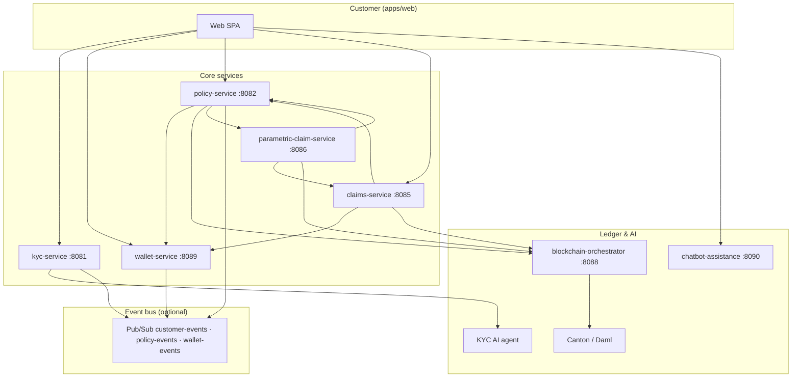
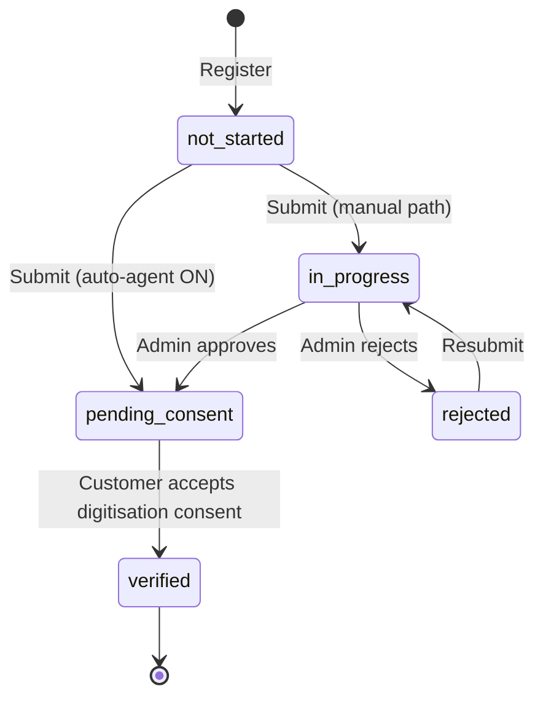
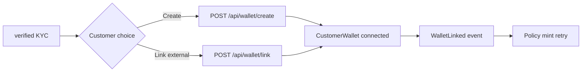
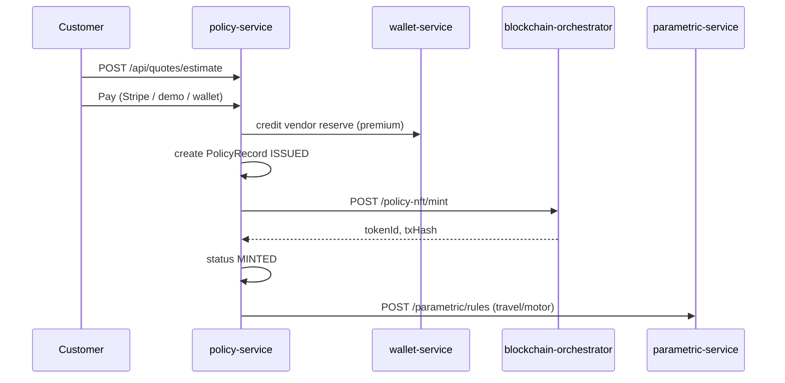
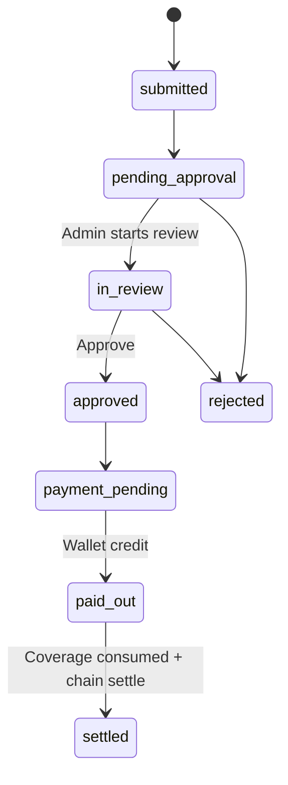
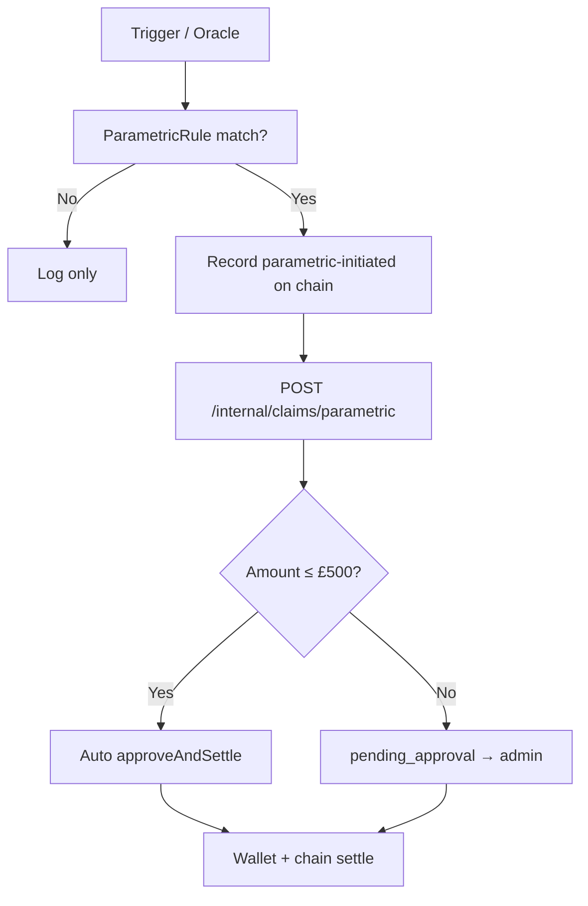
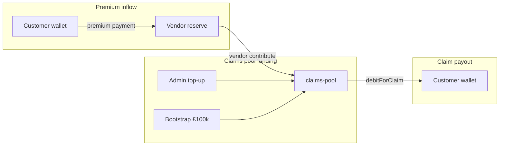
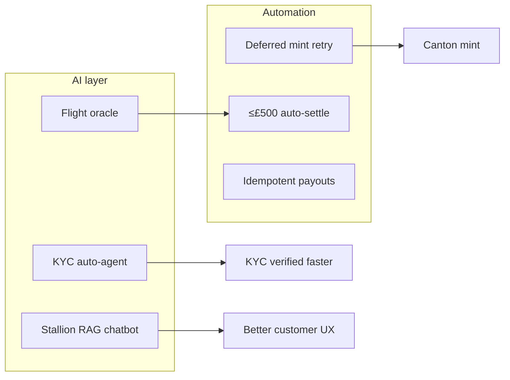

# GCUL Platform Flows — Visual Guide

End-to-end explanation of how customers move from registration to claim payout, including blockchain minting, parametric automation, and GBP fund movement across wallets.

**Related docs:** [`GCUL-INSURANCE-CHAIN.md`](GCUL-INSURANCE-CHAIN.md) · [`EVENT-CATALOG.md`](EVENT-CATALOG.md) · [`MINT-DEPOSITS-CLAIMS.md`](MINT-DEPOSITS-CLAIMS.md)

---

## Architecture at a glance



| Layer | Role |
|-------|------|
| **Customer web** | KYC wizard, wallet setup, quotes, payments, claims |
| **Admin web** | KYC review, mint queue, claim approval, parametric simulation, wallet ops |
| **wallet-service** | Customer wallets, vendor reserves, claims pool (real GBP) |
| **blockchain-orchestrator** | Policy NFT mint, Canton settlement, audit ledger |
| **parametric-claim-service** | Oracle rules, auto-triggers, ≤£500 auto-settle |

---

## 1. KYC flow

Identity verification gates wallet creation and on-chain policy minting.

### Status machine



### Step-by-step

| Step | Actor | Action | API | Result |
|------|-------|--------|-----|--------|
| 0 | Customer | Register | `POST /api/auth/register` | `kyc_status = not_started` |
| 1 | Customer | Upload ID + selfie | `POST /api/kyc/document`, `/selfie` | Files stored per user |
| 2 | Customer | Submit KYC | `POST /api/kyc/submit` | → `in_progress` or `pending_consent` |
| 3a | **AI KYC agent** | Auto-approve (default ON) | `KycAgentSettingsService` | Skips manual queue |
| 3b | Admin | Review queue | `PATCH /api/admin/customers/{id}/kyc` | `in_progress` → `pending_consent` |
| 4 | Customer | Digitisation consent modal | `POST /api/kyc/consent` | → `verified`, publishes `CustomerVerified` |

### Visual flow

```
┌─────────────┐    ┌──────────────┐    ┌─────────────────┐    ┌──────────┐
│  Register   │───►│ Upload docs  │───►│ Review / AI agent │───►│ Consent  │
│  not_started│    │ + selfie     │    │ in_progress OR  │    │ modal    │
└─────────────┘    └──────────────┘    │ pending_consent   │    └────┬─────┘
                                       └─────────────────┘         │
                                                                     ▼
                                                              ┌──────────┐
                                                              │ verified │
                                                              └──────────┘
```

### Insights

- **Two consent layers:** KYC digitisation consent (`pending_consent` → `verified`) is separate from wallet email consent (infrastructure exists but create-wallet currently activates immediately).
- **Admin “Approve” does not skip consent:** Approving in the admin UI moves to `pending_consent`, not straight to `verified`.
- **`CustomerVerified` does not create a wallet** — wallet creation is always user-initiated after KYC.
- **AI agent** (`auto_approve_agent`, default ON) bulk-approves `in_progress` when toggled on.

**Key files:** `KycSubmissionService.java`, `KycPage.tsx`, `KYCReviewPage.tsx`, `KycConsentModal.tsx`

---

## 2. Wallet linking flow

Wallets are required before a policy can be minted on Canton.

### Prerequisites

```
kyc_status === "verified"  ──required──►  POST /api/wallet/create | /link
```

### Paths



| Path | Provider | Mode | Address |
|------|----------|------|---------|
| Create secure wallet | `secure_wallet` | `demo` | SHA-256 derived `0x…` |
| Link external | `canton` | `linked` | Customer-supplied `0x…` |

### Visual flow

```
                    ┌──────────────────────────────────────┐
                    │         wallet-service               │
  KYC verified ────►│  createWallet() / linkWallet()       │
                    │       │                              │
                    │       ▼                              │
                    │  status = connected                  │
                    │       │                              │
                    │       ▼                              │
                    │  publish WalletLinked ───────────────┼──► policy-service
                    └──────────────────────────────────────┘      retries pending mints
```

### Insights

- **Deferred minting:** Policies can be **ISSUED** off-chain while waiting for wallet + KYC; `PolicyIssuanceService.onWalletLinked()` retries mint.
- **Claim auto-provision:** If a claim payout targets a customer with a known address but no wallet row, `creditClaimPayout()` provisions one.
- **Premium payments** require a connected wallet when paying via `POST /api/payments/wallet`.

**Key files:** `WalletService.java`, `WalletPage.tsx`, `PolicyIssuanceService.onWalletLinked()`

---

## 3. Policy issuance & minting flow

From quote to on-chain policy certificate (Daml/Canton NFT).

### End-to-end pipeline



### Payment paths

| Method | API | Money movement |
|--------|-----|----------------|
| Stripe / demo | `POST /api/payments/checkout` → session paid | Vendor reserve credited via `PremiumPaymentCoordinator` |
| Customer wallet | `POST /api/payments/wallet` | Customer wallet −£ → vendor reserve +£ (atomic in wallet-service) |

### Mint gates

Policy mint is **blocked** until all pass:

```
✓ Premium paid
✓ KYC verified
✓ Wallet connected (address on file)
✓ Compliance checks (consent, fraud score)
```

If blocked → policy stays **ISSUED** (off-chain) until wallet links or admin forces mint.

### Visual flow boxes

```
┌─────────┐   ┌──────────┐   ┌─────────────┐   ┌────────────┐   ┌─────────────┐
│  Quote  │──►│ Payment  │──►│ Policy ISSUED│──►│ Canton mint│──►│ MINTED NFT  │
│  Q-xxx  │   │ premium  │   │ POL-xxx      │   │ orchestrator│   │ + rules     │
└─────────┘   └────┬─────┘   └─────────────┘   └────────────┘   └─────────────┘
                   │
                   ▼
            ┌──────────────┐
            │ Vendor reserve│  vendor_premium tx
            │ vendor-vitality│
            └──────────────┘
```

### Insights

- **Idempotent issuance:** Re-playing `PremiumPaid` for the same quote does not duplicate policies; may only retry mint.
- **Admin override:** `POST /api/admin/tokenization/mint-queue/{policyId}/approve` can force mint from the tokenization queue.
- **Post-mint automation:** Travel flight-delay and motor telematics rules are auto-provisioned from quote answers.
- **Vendor mapping:** `health-plan` → vitality, `home-insurance` → homeshield; unmapped products skip vendor premium credit.

**Key files:** `PremiumPaymentCoordinator.java`, `PolicyIssuanceService.java`, `BlockchainMintClient.java`, `TokenizationPage.tsx`

---

## 4. Manual claim settlement flow

Human-in-the-loop claims filed by customer or admin.

### Status progression



### Step-by-step

| Step | Action | Service |
|------|--------|---------|
| 1 | `POST /api/claims` | Validate policy, coverage, Canton verify |
| 2 | Status → `pending_approval` | `ClaimWorkflowService.create()` |
| 3 | `POST /api/claims/{id}/review` | → `in_review` |
| 4 | `POST /api/claims/{id}/approve` | Cap amount, re-verify Canton |
| 5 | Wallet payout | `POST /api/internal/wallet/credit-claim` |
| 6 | Consume coverage | `POST /api/internal/policies/{id}/coverage/consume` |
| 7 | Chain settlement (best-effort) | `POST /api/blockchain/internal/claims/settle` |
| 8 | → `settled` | |

### Visual flow

```
 Customer                Admin                    claims-service              wallet-service
    │                      │                           │                          │
    │── submit claim ─────►│                           │                          │
    │                      │                           │── validate policy ──────►│
    │                      │                           │── Canton verify ─────────► orchestrator
    │                      │◄── pending_approval ──────│                          │
    │                      │── approve ───────────────►│                          │
    │                      │                           │── credit-claim ──────────►│
    │                      │                           │                          │ pool −£, customer +£
    │◄── funds in wallet ──────────────────────────────────────────────────────────│
```

### Insights

- **Open queries block approval** — admin must resolve claim queries first.
- **Canton re-verification** at approval time ensures on-chain policy still valid.
- **Chain settlement is best-effort** — wallet credit succeeds even if orchestrator settle fails (logged, claim still settles).
- **Approved amount capped** to remaining policy coverage.

**Key files:** `ClaimWorkflowService.java`, `ClaimsPage.tsx`, `ClaimReviewModal.tsx`

---

## 5. Parametric claim settlement flow

Oracle-driven, rules-based claims — flight delay, trip cancellation, telematics accident.

### Trigger sources

| Trigger | API | Use case |
|---------|-----|----------|
| Admin simulation | `POST /api/parametric/simulate/flight-delay` | Demo / testing |
| Trip cancellation sim | `POST /api/parametric/simulate/trip-cancellation` | Demo |
| Telematics sim | `POST /api/parametric/simulate/telematics-accident` | Demo |
| Live oracle poll | `POST /api/parametric/oracle/poll/{ruleId}` | Production flight data |

### Processing pipeline



### Visual flow

```
┌──────────────┐     ┌─────────────────┐     ┌──────────────────┐
│ Oracle / Sim │────►│ Rule evaluation │────►│ Threshold matched │
│ flight delay │     │ dedup + Canton  │     │ e.g. delay ≥ 180m │
└──────────────┘     └─────────────────┘     └────────┬─────────┘
                                                      │
                      ┌───────────────────────────────┘
                      ▼
              ┌───────────────┐     ┌─────────────────────────┐
              │ Chain record  │────►│ claims-service auto-    │
              │ oracle → pool │     │ settle (≤ £500) or queue│
              └───────────────┘     └─────────────────────────┘
```

### Insights

- **£500 auto-settle threshold** (`PARAMETRIC_AUTO_SETTLEMENT_LIMIT`) — above this, admin must approve like manual claims.
- **Rules provisioned at mint** from quote answers (flight number, dates, vehicle telematics flag).
- **Parametric chain entry** (`parametric-initiated`) is **audit-only** — it does not move wallet-service balances; real GBP moves at `credit-claim`.
- **Dedup & conflict rules** prevent double-payout for the same travel date or event.

**Key files:** `ClaimInitiatedProcessor.java`, `ParametricTriggerService.java`, `ParametricPage.tsx`

---

## 6. Fund transfer flow (claim success)

How GBP actually moves when a claim is approved and settled.

### Money pools



### Claim payout sequence (wallet-service)

```
┌─────────────────┐         debitForClaim(claimId, £X)         ┌──────────────────┐
│  claims-pool    │ ────────────────────────────────────────────►│ pool_claim_debit │
│  PlatformWallet │                                            │  balance −£X     │
└─────────────────┘                                            └──────────────────┘
         │
         │  credit customer wallet (+£X)
         ▼
┌─────────────────┐
│ customer_wallet │  tx: claim_payout, ref: CLM-xxx
│ balance +£X     │
└─────────────────┘
```

### Parallel blockchain ledger (orchestrator)

| Step | From | To | Purpose |
|------|------|-----|---------|
| Parametric match | `gcul:oracle` | `gcul:claims-pool` | Audit trail before claim creation |
| Claim settle | `gcul:claims-pool` | `gcul:customer:{id}` | On-chain settlement record |

### Full fund lifecycle insight map

| Event | From | To | Tx type |
|-------|------|-----|---------|
| Premium (wallet) | Customer wallet | Vendor reserve | `premium` + `vendor_premium` |
| Premium (Stripe) | External | Vendor reserve | `vendor_premium` |
| Vendor funds insurer | Vendor reserve | Claims pool | `vendor_contribution` |
| Admin pool top-up | External | Claims pool | `pool_top_up` |
| Claim settled | Claims pool | Customer wallet | `pool_claim_debit` + `claim_payout` |

### Insights

- **Claims are paid from claims-pool, not vendor reserve directly** — vendors must contribute reserve → pool before payouts are sustainable.
- **Idempotent per claimId** — duplicate `credit-claim` calls skip second debit/credit.
- **Demo seed:** claims-pool starts at £100,000; each vendor reserve seeded at £50,000.
- **Wallet path is source of truth for GBP** — Canton/sidecar ledger mirrors for audit and compliance.

**Key files:** `ClaimsPoolService.java`, `VendorReserveService.java`, `WalletOpsPage.tsx`, `VendorPortalPages.tsx`

---

## 7. AI & automation touchpoints

| Capability | Where | What it does |
|------------|-------|--------------|
| **KYC AI agent** | kyc-service | Auto-approves submissions when enabled; reduces manual queue |
| **Stallion chatbot** | chatbot-assistance-service | RAG insurance Q&A on customer web (`/api/chatbot/ask`) |
| **Screen assistant** | kyc-service | Contextual hints per screen (`/api/assistant/message`) |
| **Parametric oracle** | parametric-service | Polls flight APIs; auto-triggers claims when thresholds met |
| **Fraud scorer** | blockchain-orchestrator | Heuristic score on chain transactions at mint/settle |
| **Pub/Sub events** | All services | `CustomerVerified`, `WalletLinked`, `PremiumPaid`, `PolicyMinted` — async decoupling |



---

## Quick reference — APIs by journey

| Journey stage | Customer APIs | Admin APIs |
|---------------|---------------|------------|
| KYC | `/api/kyc/*`, `/api/auth/*` | `/api/admin/kyc-queue`, `/api/admin/customers/{id}/kyc` |
| Wallet | `/api/wallet/create`, `/link`, `/pay` | `/api/admin/wallet-ops` |
| Policy | `/api/quotes/*`, `/api/payments/*` | `/api/admin/tokenization/*` |
| Claims | `/api/claims` | `/api/claims/{id}/approve` |
| Parametric | — | `/api/parametric/simulate/*`, `/oracle/poll/{id}` |
| Vendor funding | `/api/vendor-portal/claims-pool/contribute` | `/wallet` ops, `/vendors` |

---

## Demo walkthrough (local)

1. Register → complete KYC → accept consent → **verified**
2. Create wallet → **WalletLinked** → any pending policies mint
3. Buy policy (wallet pay) → vendor reserve credited
4. Vendor portal → contribute to claims pool
5. File claim (manual) or simulate parametric delay on admin **Parametric** page
6. Approve claim (or auto if ≤£500 parametric) → customer wallet credited from claims-pool

**Local URLs:** customer `http://localhost:5174` · admin `http://localhost:5175` · vendor portal `http://localhost:5175/vendor/portal`
